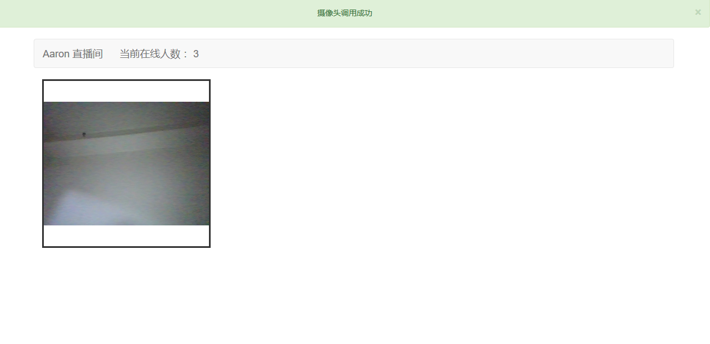
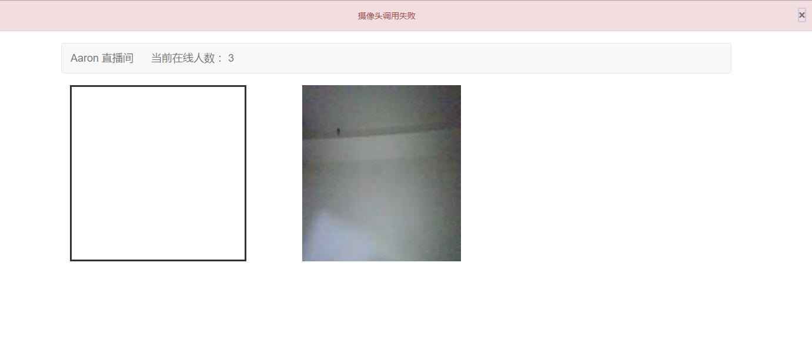

# My_livecamera
大家好，这是我个人的直播间。前端H5、后台采用PHP的swoole扩展加websocket协议实现。目前该直播只支持火狐浏览器，因为chrome浏览器需要ssl协议，所以暂不支持。当打开网页时，浏览器会提示你是否接受摄像头的调用，您点击确定就可以了。开启直播肯定需要硬件支持啦......下面是开发当中的一些截图
## 这是主播的界面

## 这是接收的界面

